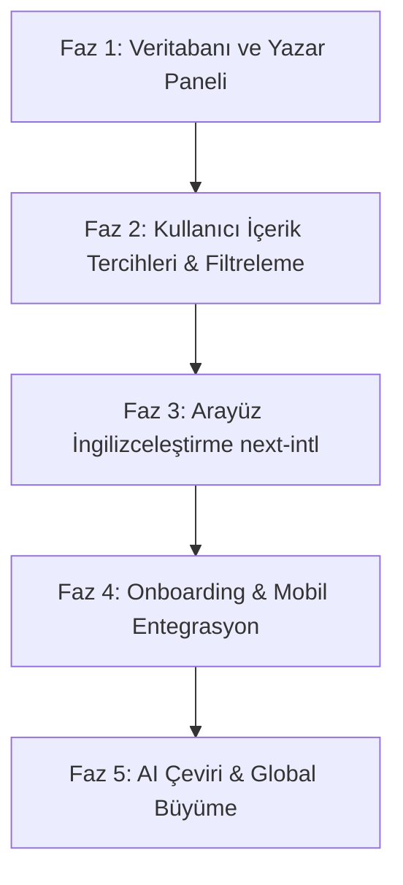

# Readixon Global Genişleme & Çoklu Dil (i18n & Localization) Master Planı

Bu belge, **Readixon** platformunun Türkiye pazarından küresel (global) pazara kademeli, güvenli ve sürdürülebilir bir şekilde açılması için hazırlanmış kapsamlı yol haritasıdır.

---

## 1. Temel Vizyon & Okuma Platformlarının Küresel Paradoksu

Bir e-ticaret veya SaaS uygulamasını küresele açmak basittir: Menüleri ve butonları İngilizceye çevirirsiniz ve çalışır.  
Ancak **Readixon gibi bir okuma, yazma ve topluluk platformunda** durum çok farklıdır:

> **"Cold Start (Soğuk Başlangıç) Paradoksu":**  
> Amerikalı veya yabancı bir okuyucu uygulamayı indirdiğinde arayüz kusursuz İngilizce olsa bile, Ana Sayfa'da ve Keşfet'te sadece Türkçe hikayeler görürse *"Bu platform bana göre değilmiş"* diyerek 10 saniye içinde uygulamayı siler.  
> Benzer şekilde, Türk bir okuyucu da kendi dilinde hikaye bulmak isterken ilgisiz yabancı içeriklerle boğulmak istemez.

Bu yüzden Readixon'ın globale açılması **2 ayrı katmanda** ele alınmalıdır:
1. **Arayüz Katmanı (UI Localization):** Menüler, butonlar, bildirimler, hata mesajları.
2. **İçerik & Topluluk Katmanı (Content & Discovery):** Hikaye dilleri, kullanıcı dil tercihleri, feed algoritmaları ve yabancı içerik arzı.

---

## 2. Stratejik Seçenekler (Hangi Model Bize Uygun?)

| Model | Nasıl Çalışır? | Avantajı | Dezavantajı | Readixon İçin Uygunluk |
| :--- | :--- | :--- | :--- | :--- |
| **Model A: Katı Ayrım (Bölgesel Siteler)** | `tr.readixon.com` ve `en.readixon.com` olarak iki ayrı dünya. | Karışıklık olmaz, tam yerelleşme. | Topluluk bölünür, iki ayrı site yönetmek gerekir. | ❌ Tavsiye Edilmez |
| **Model B: Organik Çok Dilli Platform (Wattpad Modeli)** | Tek platform; hikayeler dil etiketine sahiptir. Kullanıcı hangi dilleri okumak istediğini seçer (Örn: TR + EN). | Tek veri tabanı, tek mobil uygulama, küresel tek marka. | İlk başta İngilizce hikaye sayısı az olabilir. | ⭐ **Güçlü Aday** |
| **Model C: AI Köprüsü Destekli Hibrit Model (Webtoon/Tapas Modeli)** | Model B'ye ek olarak; Türk yazarların kaliteli hikayelerini tek tıkla AI ile İngilizceye çevirip platformu ilk günden zenginleştirme. | Yabancı kullanıcı ilk günden kaliteli içerik bulur. Yazarlarımız globale açılır. | AI çevirilerinin yazar tarafından kontrol edilmesi gerekir. | 🚀 **En İdeal Model (Önerilen)** |

---

## 3. Sistem Mimarisi & Teknik Altyapı

### 3.1. Arayüz Dili (UI Localization)
* **Kütüphane:** Next.js 14 App Router ile tam uyumlu, Server Component dostu ve hafif olan **`next-intl`**.
* **Dil Dosyaları:**
  * `messages/tr.json` (Türkçe metinler)
  * `messages/en.json` (İngilizce metinler)
* **Dil Tespiti:**
  1. Kullanıcı daha önce tercih seçtiyse: `localStorage` / Profil ayarı.
  2. İlk girişte: Tarayıcı / Telefon dili (`navigator.language`).
  3. Manuel Değiştirme: Profil/Ayarlar menüsünden veya altbilgiden kolayca geçiş.

### 3.2. Veritabanı Modeli (Firestore Değişiklikleri)

```typescript
// 1. Hikaye Modeli (Story)
interface Story {
  // ... mevcut alanlar ...
  language: 'tr' | 'en' | 'es' | 'de'; // Hikayenin yazıldığı dil (Varsayılan: 'tr')
  originalStoryId?: string; // Eğer başka dilden çevrilmiş bir versiyonsa ana hikaye ID'si
}

// 2. Bölüm Modeli (Chapter)
interface Chapter {
  // ... mevcut alanlar ...
  language: 'tr' | 'en';
}

// 3. Kullanıcı Tercihleri (User Profile)
interface UserProfile {
  // ... mevcut alanlar ...
  uiLanguage: 'tr' | 'en'; // Arayüz dili
  contentLanguages: string[]; // Okumak istediği içerik dilleri (Örn: ['tr', 'en'] veya sadece ['en'])
}
```

### 3.3. Keşfet ve Akış Filtreleme Mantığı

```typescript
// Örnek: Keşfet Sayfası veya Ana Akış Sorgusu
const userContentLangs = user?.contentLanguages || ['tr'];

// Firestore query
const q = query(
  collection(db, 'stories'),
  where('status', '==', 'published'),
  where('language', 'in', userContentLangs), // Yalnızca kullanıcının seçtiği dillerdeki hikayeler
  orderBy('stats.views', 'desc'),
  limit(20)
);
```

---

## 4. Kademeli Uygulama Yol Haritası (5 Faz)



### 📍 Faz 1: Sessiz Altyapı Hazırlığı (Kullanıcıyı Etkilemeyen Aşama)
* **Amaç:** Mevcut sistemi bozmadan veri modeline dil bilincini kazandırmak.
* **Yapılacaklar:**
  1. Mevcut tüm hikayelere arka planda varsayılan olarak `language = 'tr'` tanımlanması.
  2. Yazar Stüdyosu'nda (Yeni Hikaye Oluşturma / Düzenleme): *"Hikaye Dili"* seçeneğinin eklenmesi (Türkçe, English).
  3. Bölüm editöründe dil bilgisinin tutulması.

### 📍 Faz 2: İçerik Tercihleri ve Akış Filtreleme
* **Amaç:** Kullanıcıların istemedikleri dildeki içerikleri görmesini engellemek.
* **Yapılacaklar:**
  1. Ayarlar sayfasına *"İçerik Dili Tercihleri"* eklenmesi (Örn: `[X] Türkçe`, `[X] English`).
  2. Ana sayfa (Feed), Keşfet (Explore), Trendler ve Arama sorgularının kullanıcının seçili dillerine göre filtrelenmesi.
  3. Kategori/Tür listelerinin seçili dile göre filtrelenmesi.

### 📍 Faz 3: Arayüz Yerelleştirmesi (UI i18n - Next-intl)
* **Amaç:** Sitenin ve uygulamanın menülerini İngilizce konuşan birinin rahatça kullanabilmesi.
* **Yapılacaklar:**
  1. `next-intl` kütüphanesinin projeye kurulması.
  2. Sabit metinlerin JSON sözlüklerine çıkarılması (`tr.json` ve `en.json`):
     * Navigasyon (Keşfet, Yaz, Kitaplığım, Bildirimler)
     * Okuyucu Sayfası (Yorum yap, Yazı tipi, Beğen, Sonraki Bölüm)
     * Yazar Stüdyosu (Taslaklar, Yayınla, İstatistikler)
     * Giriş & Kayıt Formları
  3. Ayarlar ekranına *"Uygulama Dili (TR / EN)"* seçeneği eklenmesi.

### 📍 Faz 4: Mobil Uygulama & Onboarding Entegrasyonu
* **Amaç:** Uygulamayı ilk kez indiren yabancı bir kullanıcıya kusursuz karşılama sunmak.
* **Yapılacaklar:**
  1. Mobil Onboarding (İlk Açılış): Cihaz dili İngilizce ise onboarding ekranlarının doğrudan İngilizce gelmesi.
  2. Onboarding sırasında: *"Hangi dillerde okumak istersiniz?"* adımı (Kullanıcıya özel ana sayfa hazırlama).
  3. FCM Push Bildirimleri: Bildirim şablonlarının kullanıcının diline göre tetiklenmesi.

### 📍 Faz 5: Global İçerik Arzı & Büyüme (Game Changer)
* **Amaç:** Platformda yabancı okuyucu için bolca kaliteli içerik olmasını sağlamak.
* **Yapılacaklar:**
  1. **Yazar AI Çeviri Asistanı:** Türk yazarların kendi hikayelerini tek tıkla yüksek kaliteli edebiyat çevirisiyle (Claude/GPT-4o API) İngilizceye çevirip "İngilizce Versiyon" olarak yayınlayabilmesi.
  2. **Yabancı Yazarları Çekme:** Yabancı bağımsız yazarlar (Wattpad/RoyalRoad alternatifi arayanlar) için platformun modern arayüzü ve yazar gelir modeliyle tanıtımı.
  3. **RX Puanı & Global Ödeme:** PayTR veya Stripe ile yabancı kredi kartlarından bağış / RX Puan satın alımı desteği.

---

## 5. Kritik Karar Noktaları (Cevaplamamız Gereken Sorular)

Bu plana başlamadan önce üzerinde konuşup netleştireceğimiz 5 soru:

1. **İlk Yabancı Dil:** Sadece **İngilizce** ile mi başlayalım, yoksa İspanyolca/Almanca gibi dilleri de baştan esnek bir mimariyle hazır mı tutalım? *(Tavsiye: Mimari çoklu dile hazır olsun ama başlangıçta sadece TR ve EN aktif edilsin).*
2. **Yorumlar ve Topluluk:** Bir İngilizce hikayenin altına Türkçe yorum yapılabilir mi? Yoksa yorum alanları da dil bazlı mı ayrışmalı? *(Tavsiye: Sosyal medyada olduğu gibi serbest bırakılmalı, gerekirse "Çevir" butonu konulmalı).*
3. **Mevcut Yazarların Tepkisi:** Platformdaki mevcut Türk yazarlara hikayelerini İngilizceye çevirip dünyaya açılma fırsatı sunmak ister misin?
4. **Ödeme Altyapısı:** İleride yabancı kullanıcılar yazar destekleme/bağış yapmak istediğinde uluslararası ödeme (Stripe / LemonSqueezy) gerekecek mi?
5. **Uygulama İçi Arama:** Arama motorumuz (Algolia veya Firestore arama) aynı anda hem Türkçe hem İngilizce sonuçları mı aramalı?

---

## 6. Sıradaki Adım Önerisi

Eğer bu yol haritası aklına yattıysa, sistemi riske atmamak adına **Faz 1 (Veritabanı ve Yazar Paneline Hikaye Dili Eklenmesi)** ile sakin bir başlangıç yapabiliriz. Bu sayede hiçbir şey kırılmaz, platform yavaş yavaş küresel içeriği sınıflandırmaya başlar.
